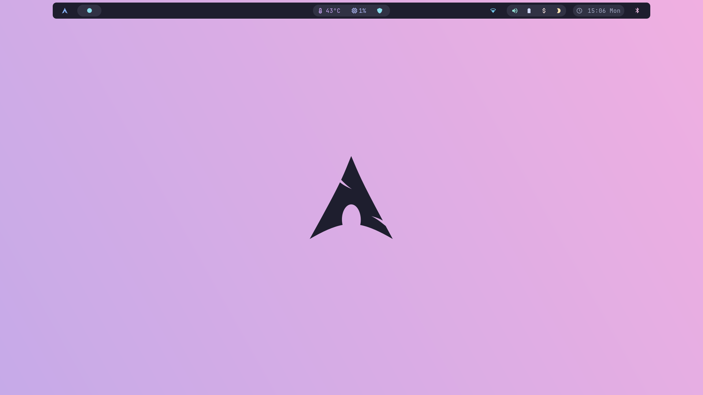
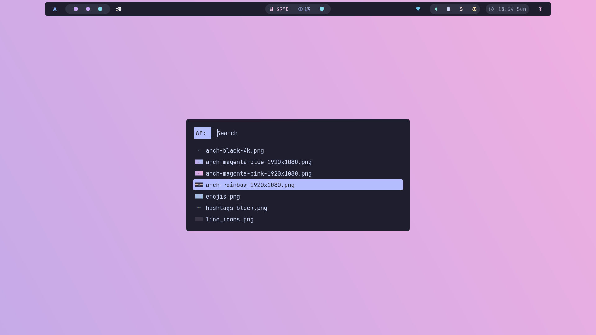
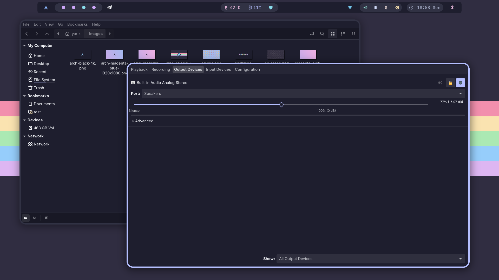
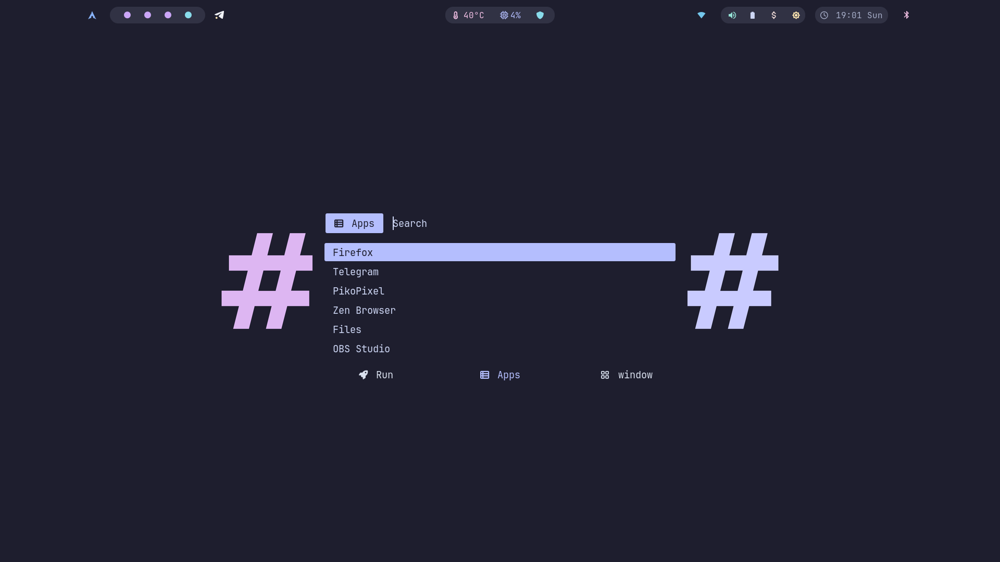

# Niri Dotfiles
Niri setup based on Catppuccin Mocha color palette

## Programs
-   OS: *arch*
-   Shell: *fish + starship*
-   Terminal: *kitty*
-   WM: *niri*
-   Wallpaper Engine: *awww*
-   Bar: *waybar*
-   Editor: *helix*
-   Menu: *rofi*

## Links
- Telegram theme you can find here: [link](https://github.com/catppuccin/telegram)
- Beautiful wallpapers you can find here: [link](https://github.com/zhichaoh/catppuccin-wallpapers)
- Gtk themes and Bibata cursor theme you can download from AUR

---

# Installation

+ Download packages:
```bash
pacman -S fish kitty niri starship waybar helix rofi awww 
```

+ Set up shell:
```bash
chsh -s /usr/bin/fish <user>
```

+ Copying configuration files:
```bash
cd
git clone https://github.com/Perelmeshcka/niri-dots.git
cp -r niri-dots/dot-config/* .config/
```

---

# Screenshots







